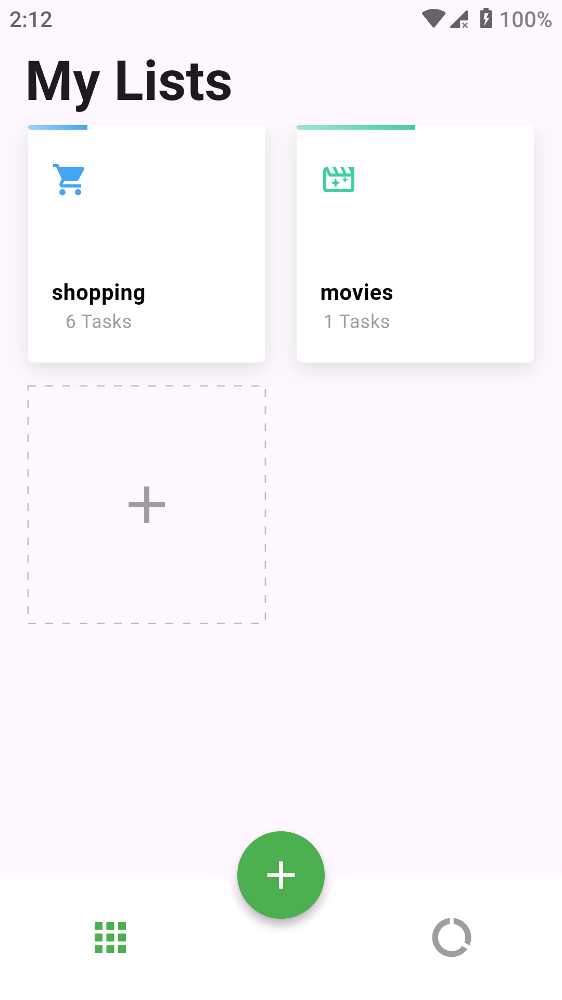
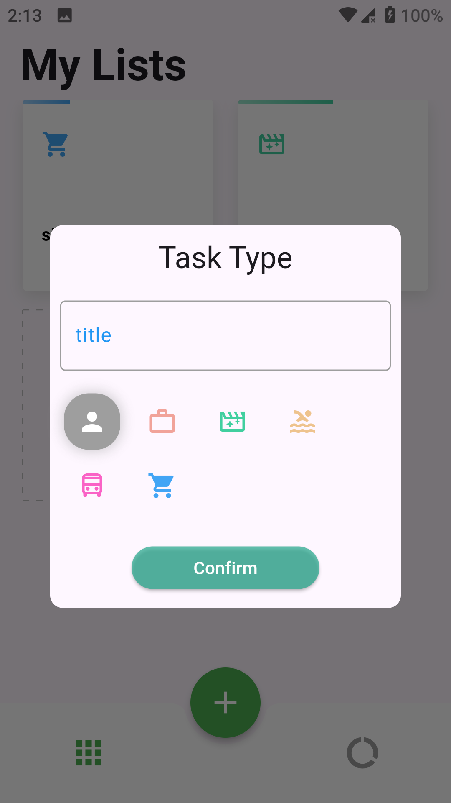
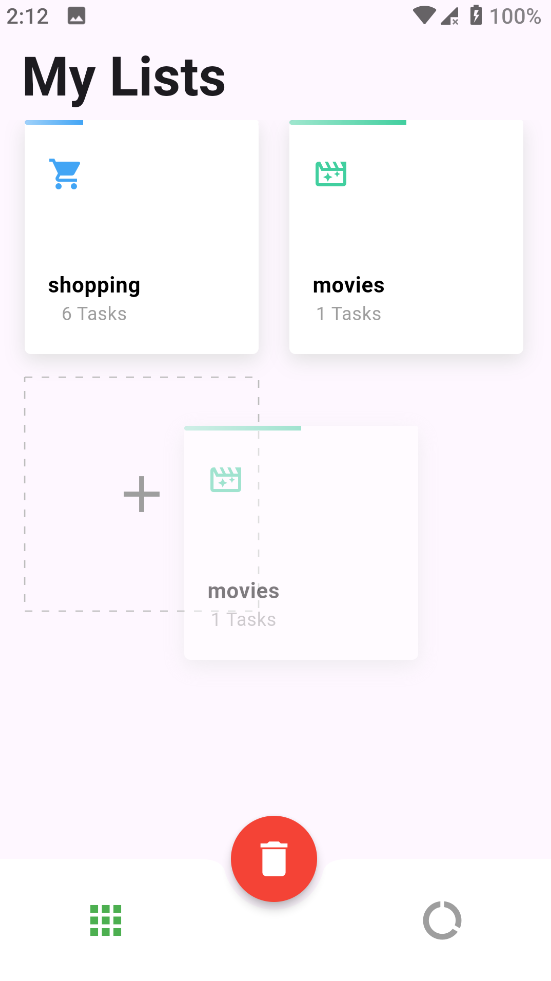
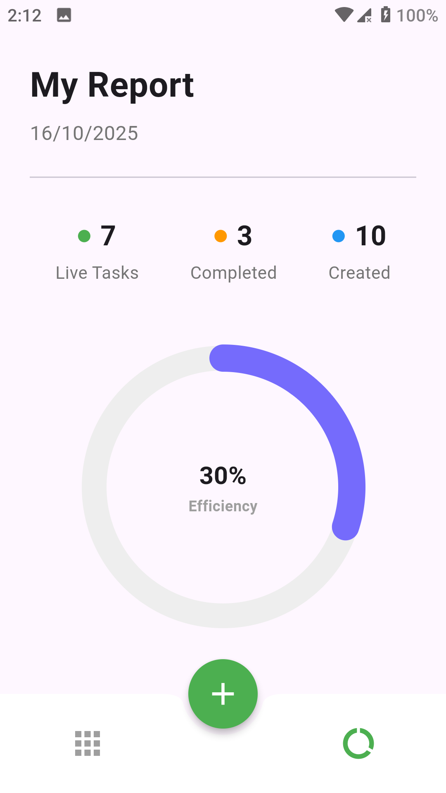

# 📝 To-Do App

A simple and efficient **task management app** built with **Flutter**, designed to help users stay organized, track their progress, and manage daily tasks with ease.

---

## 🌟 Features

- ✅ **Task Categories** — Create and customize categories with names and icons.  
- 🗂 **Task Management** — Add, edit, and delete tasks within each category.  
- 📊 **Progress Tracking** — Visual indicators show your completed and uncompleted tasks.  
- 📅 **Live Reports** — See real-time statistics of all created, completed, and pending tasks, plus efficiency rate.  
- 💾 **Offline Storage** — Uses **Hive** for fast and reliable local data storage.  
- ⚡ **State Management** — Powered by **GetX** for smooth, reactive UI updates.  

---

## 🛠️ Tech Stack

| Component | Technology |
|------------|-------------|
| **UI Framework** | Flutter |
| **State Management** | GetX |
| **Local Database** | Hive |

---

## 📱 Screens Overview

- **Home Page:** Displays all task categories with progress bars.  
- **Tasks Page:** Add, remove, and complete tasks under a specific category.  
- **Report Page:** View real-time statistics for efficiency, completed, and total tasks.

---
## 📸 Screenshots

Here are the main app screens:

### 🏠 Home Screen


### 🗂️ Category Screen


### ➕ Add Task Screen


### 📋 Tasks Screen


### 🗑️ Delete Task Example


### 📊 Report Page



## 🚀 Getting Started

Follow these steps to run the project locally:

### 1. Clone the repository
```bash
git clone https://github.com/mahmoud123asd/toDoApp.git
